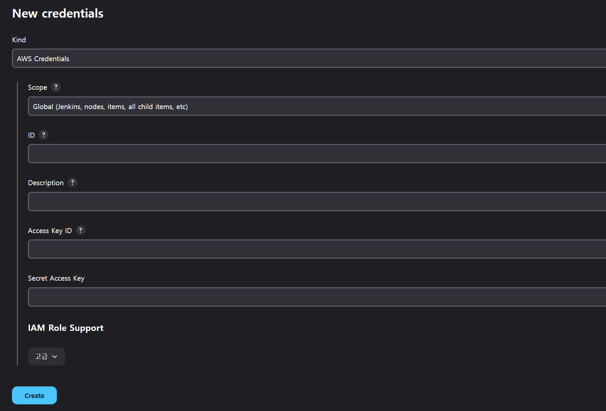
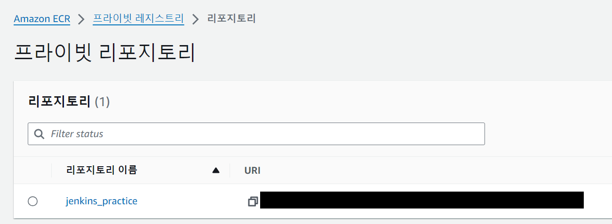
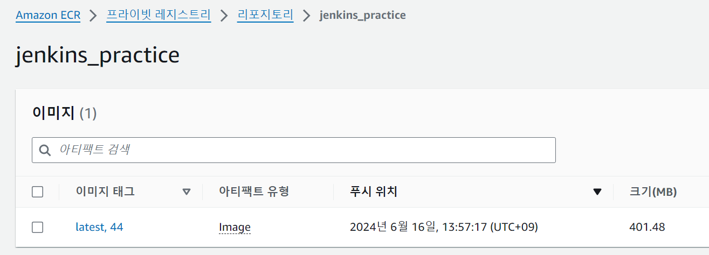

# Jenkins 구성

[private repository에 구성](https://github.com/McNal1828/Jenkins-practice/tree/main/private-repository)하는 경우와 비슷하게 구성이 된다.

차이점은 `deploy stage` 에서 이미지를 push하는 주소를 ECR, 혹은 docker-hub로 변경하고 그에 맞는 `credential`을 적용하면 된다.

## credential 구성

ECR사용을 위한 `Access Key` / `Secret Access key`를 생성한다.

> IAM > 사용자 > 보안 자격 증명 > 액세스 키
>
> `AmazonEC2ContainerRegistryFullAccess`, `AmazonEC2ContainerRegistryPowerUser` 등 의 정책이 할당된 사용자여야한다.
>
> 관련 정책은 `registry`를 검색하여 필요한 정책을 할당하자.

생성된 `Access Key` / `Secret Access key`를 사용하여 Jenkins에 `credential`을 생성한다.

이를 위해 `AWS Global Configuration Plugin`을 설치하면 `credential`생성 시 kind 선택란에 `AWS Credentials`가 추가된다.



- tepe : `AWS Credentials`
- id : credential 이름
- Access key ID : `Access key`
- Secret Access Key : `Secret Access key`

## ECR 구성

private repository를 구성한다.



## Jenkinsfile 구성

생성한 credential과 ecr repository의 url을 사용하여 구성한다.

`Amazon ECR` plugin을 설치하고 plugin의 [공식문서](https://plugins.jenkins.io/amazon-ecr/)를 참고하여 작성한다.

> docker hub 등에 업로드 하는 방식으로 `docker.withRegistry(URL,Credential_ID)` 로 작성하면 동작하지 않고 credential을 `ecr:ap-southeast-2:Credential_ID`로 작성하여야 한다.
>
> repository와 region을 통일하는 것을 잊지말자

```Groovy
pipeline{
    agent any
    tools { nodejs 'lts20'}
    environment {
        DOCKER_IMAGE = "jenkins_practice"
        DOCKER_REGISTRY_URL = "https://851725225660.dkr.ecr.ap-southeast-2.amazonaws.com"
    }
    stages{
        stage('build'){
            steps{
                script{
                    sh 'npm install'
                    appImage = docker.build("${DOCKER_IMAGE}")
                }
            }
        }
        stage('push'){
            steps{
                script{
                    sh 'rm -f ~/.dockercfg ~/.docker/config.json || true'
                    docker.withRegistry("${DOCKER_REGISTRY_URL}","ecr:ap-southeast-2:aws_credential"){
                        appImage.push("${env.BUILD_ID}")
                        appImage.push("latest")
                    }
                }
            }
        }
    }
}
```

# 실행결과

ECR로 정상적으로 image가 build되고 push되는 것을 확인할 수 있다.

