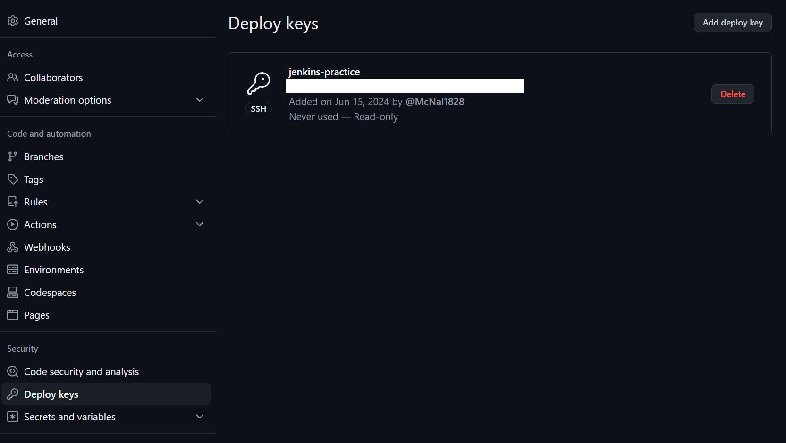

# Jenkins 를 사용한 pipeline 구축

Jenkins를 설치하고 github를 사용하여 CI/CD pipeline을 구축한다.

## 시스템구성

- VM
  - ubuntu-live-server-22.04
  - 2 cpu
  - 4GB RAM
  - 32GB Disk

> Jenkins 최소권장사양인 4GB RAM을 할당한다

## 사전 준비

### JAVA

```sh
sudo apt update
sudo apt install fontconfig openjdk-17-jre
```

### Jenkins

[공식홈페이지의 문서](https://www.jenkins.io/doc/book/installing/linux/#debianubuntu)를 참고하여 설치를 진행한다.

> Jenkins 2.452.2(2024.06.14)버전으로 진행

#### Jenkins LTS release

```sh
sudo wget -O /usr/share/keyrings/jenkins-keyring.asc \
  https://pkg.jenkins.io/debian-stable/jenkins.io-2023.key
echo "deb [signed-by=/usr/share/keyrings/jenkins-keyring.asc]" \
  https://pkg.jenkins.io/debian-stable binary/ | sudo tee \
  /etc/apt/sources.list.d/jenkins.list > /dev/null
sudo apt-get update
sudo apt-get install jenkins
```

#### 설치 확인 및 실행

```sh
sudo systemctl enable jenkins
sudo systemctl start jenkins
sudo systemctl status jenkins
```

기본 포트는 `8080`번이며 초기 `Administrator password`는 `/var/lib/jenkins/secrets/initialAdminPassword`의 log로 확인가능하다

> 시스템에 따라서 log의 위치는 변경될 수 있다. 웹 브라우저에 나타나는 주소를 확인한다.

default plugin을 설치하며 초기 세팅을 마무리한다.

### docker

dockerfile을 통해 build 하기 위해서 docker를 설치한다.

[공식홈페이지의 문서](https://docs.docker.com/engine/install/ubuntu/)를 참고하여 설치를 진행한다.

> docker 26.1.4(2024.06.14)버전으로 진행

```sh
# Add Docker's official GPG key:
sudo apt-get update
sudo apt-get install ca-certificates curl
sudo install -m 0755 -d /etc/apt/keyrings
sudo curl -fsSL https://download.docker.com/linux/ubuntu/gpg -o /etc/apt/keyrings/docker.asc
sudo chmod a+r /etc/apt/keyrings/docker.asc

# Add the repository to Apt sources:
echo \
  "deb [arch=$(dpkg --print-architecture) signed-by=/etc/apt/keyrings/docker.asc] https://download.docker.com/linux/ubuntu \
  $(. /etc/os-release && echo "$VERSION_CODENAME") stable" | \
  sudo tee /etc/apt/sources.list.d/docker.list > /dev/null
sudo apt-get update

sudo apt-get install docker-ce docker-ce-cli containerd.io docker-buildx-plugin docker-compose-plugin
```

### github ssh

jenkins가 github에서 pull할 수 있도록 Credential을 추가한다.

ssh키를 사용하기 위해 Jenkins서버에서 `ssh-keygen`을 통해 ssh key를 생성한다.

```sh
ssh-keygen
```

> 기본설정으로 진행하면 private key 인 id_rsa, public key인 id_rsa.pub 두개의 파일이 생성된다.

public key를 github의 `사용자` > `Settings` > `SSH and GPG keys`에 등록한다.


> 각 repository 별로 `repository` > `Settings` > `Deploy keys` 에 등록하여 사용하여도 된다.
> 

private key를 Jenkins의 `Jenkins 관리` > `Credentials` > `System (global)` > `Add Credentials`로 추가한다.


> ssh가 아닌 github의 `Personal access token(classic)` 을 사용해도 된다. 이 경우 token의 권한은 `repo`와 `admin:repo_hook`을 지정한다. Jenkins에서의 credential은 `Username with password`로 하고 `Username` 에 `github 사용자이름`을, `Password`에 `access token`을, `ID`에 `credential 이름`을 작성하면 된다.

## service

github와 jenkins를 연동하기 위하여 간단한 [nodejs 웹서버 서비스](https://github.com/McNal1828/Jenkins-practice-service)를 제작한다.

# 구성 시작

- [kubernetes에 Jenkins 구성](https://github.com/McNal1828/Jenkins-practice/tree/master/Jenkins-k8s)
- [Github -> Jenkins -> private repository](https://github.com/McNal1828/Jenkins-practice/tree/master/private-repository)
- [Github -> Jenkins -> ECR](https://github.com/McNal1828/Jenkins-practice/tree/master/ECR-repository)
- [Github -> ECR(Github Action)](https://github.com/McNal1828/Jenkins-practice/tree/master/GithubAction)
- [kustomize](https://github.com/McNal1828/Jenkins-practice/tree/master/kustomize)
- [Argo CD 구성](https://github.com/McNal1828/Jenkins-practice/tree/master/ArgoCD)
- [EKS에 Jenkins 구성]()