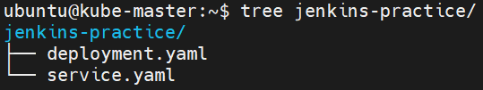
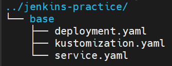
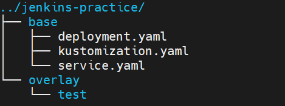
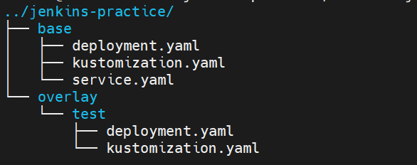
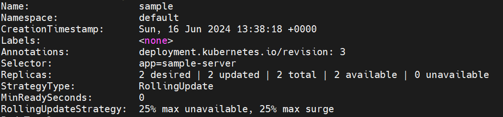

# kustomize 구성

## kustomize

Kubernetes 배포를 위하여 이미지를 선택할 때 `latest`태그를 주로 사용한다.

하지만 `latest`가 어느 시점의 `latest`인지 어떻게 판단할 것이며 이미지의 버전관리는 어떻게 해야하는 지에 대한 의문이 생긴다.

이를 위해 사용하는 것이 `Manifest`파일이다.

그렇다면 `Manifest`파일은 어떻게 관리할까?

단순히 파일을 복사해서 붙여넣기를 하는 방법도 있지만 새로운 환경(`prod`, `test`, `dev`)에 배포해야 하는 상황이 생긴다면 반복작업이 늘어나게 된다.

또한 환경별로 다양한 이미지들의 버전을 각각 설정해야 한다면 작업은 배가 된다.

서로 다른 환경이어도 서로간의 `Manifest` 파일은 대부분 겹치는 내용이고 일부 부분만 추가, 변경되는 것이 대부분이다.

이를 위해 사용하는 것이 `kustomize`이다.

`kustomize`는 공통된 부분(base)과 차이가 발생하는 부분(overlay)을 분리하여 관리한다.

배포시 base와 overlay를 merge하여 리소스를 생성하게 된다.

추가적으로 `ConfigMap`, `Secret`, `Prefix`를 추가하는 등 다양한 기능을 제공한다.

`kustomize`를 적용한 `manifest`는 주로 `Git repository`에서 관리하고 배포 과정의 자동화에 사용하게 된다.

---

### why git?

base와 overlay의 버전관리를 위해 사용하게 된다.

원격 repository를 이용한 새로운 환경에 적용의 이점 뿐 아니라 서로 다른 사람이 중복해서 버전을 변경하였을 때 발생하는 문제를 방지할 수 있다.

해당 repository의 접근권한 제한을 통하여 소수의 사람이 이를 관리하게 하여 중복된 업데이트를 최소화하여 관리가 가능한 이점 또한 있다.

---

## kustomize 적용

kubernetes 1.14 이후 버전부터 built-in 기능으로 포함되어있다. `kubectl -k` 혹은 `kustomize` 옵션으로 실행할 수 있다.

혹은 binary 방식으로 설치할 수 있다.

```sh
curl -s "https://raw.githubusercontent.com/kubernetes-sigs/kustomize/master/hack/install_kustomize.sh"  | bash
sudo mv kustomize /usr/local/bin
kustomize version
```

생성한 이미지를 활용하여 간단한 depolyment와 service를 구성한다.

```yaml
apiVersion: apps/v1
kind: Deployment
metadata:
  name: sample
spec:
  replicas: 1
  selector:
    matchLabels:
      app: sample-server
  template:
    metadata:
      labels:
        app: sample-server
    spec:
      containers:
        - name: sample
          image: 192.168.230.151:30080/jenkins-practice-service:latest
          ports:
            - name: httpport
              containerPort: 3000
```

```yaml
apiVersion: v1
kind: Service
metadata:
  name: sample-service
spec:
  selector:
    app: sample-server
  type: NodePort
  ports:
    - port: 3000
      targetPort: 3000
      nodePort: 31000
```




정상 동작함을 확인하였다.

---

### kustomize 파일 생성

작성한 `deployment.yaml`과 `service.yaml`을 `base`로 `kustomization.yaml` 파일을 생성한다.

```yaml
resources:
- deployment.yaml
- service.yaml
```



`base`폴더와 같은 레벨에 `overlay`폴더를 생성하고 `test`하위폴더를 생성한다.



`test` 하위폴더에 `replicas: 2` 인 deployment.yaml 을 작성한다

```yaml
apiVersion: apps/v1
kind: Deployment
metadata:
  name: sample
spec:
  replicas: 2
```

`kustomize`는 일부분만 작성된 Patch파일 내용을 `base`의 Manifest와 Merge하여 새로운 Manifest를 생성한다.

`namespace`와 `name`이 모두 일치하는 리소스를 찾아 항목을 추가하거나 겹치는 항목을 덮어쓰는 방식으로 동작한다.

`overlay/test`폴더에도 `kustomization.yaml`파일을 추가한다.

```yaml
bases:
- ../../base
patchesStrategicMerge:
  - deployment.yaml
```

- base : base Manifest 파일이 위치한 경로를 명시한다. 여러개를 지정할 수 있다.
- patchesStrategicMerge : 덮어씌울 Patch파일들을 명시한다.
  


다음 명령어를 통해 Manifest 파일이 생성되는지 확인한다

```sh
kubectl kustomize overlay/test/
```

> 동작하고 나면 `bases` 와 `patchesStrategicMerge`는 deprecated되었으니 대신 `resources`와 `patches`를 사용하라고 알람이 뜬다.

```yaml
apiVersion: v1
kind: Service
metadata:
  name: sample-service
spec:
  ports:
  - nodePort: 31000
    port: 3000
    targetPort: 3000
  selector:
    app: sample-server
  type: NodePort
---
apiVersion: apps/v1
kind: Deployment
metadata:
  name: sample
spec:
  replicas: 2
  selector:
    matchLabels:
      app: sample-server
  template:
    metadata:
      labels:
        app: sample-server
    spec:
      containers:
      - image: prireg.mcnal.net/jenkins-practice-service:latest
        name: sample
        ports:
        - containerPort: 3000
          name: httpport
```

`overlay/test`에 지정한 `replicas: 2`로 작성되는 것을 확인할 수 있다.

pipeline을 활용하여 바로 적용시킬 수 있다.

```sh
kubectl kustomize overlay/test | kubectl apply -f -
```



업데이트 된 것을 확인할 수 있다.

추가로 각 환경별로 namespace를 새로이 생성하여 배포하는 등 다양한 방식으로 활용할 수 있다.