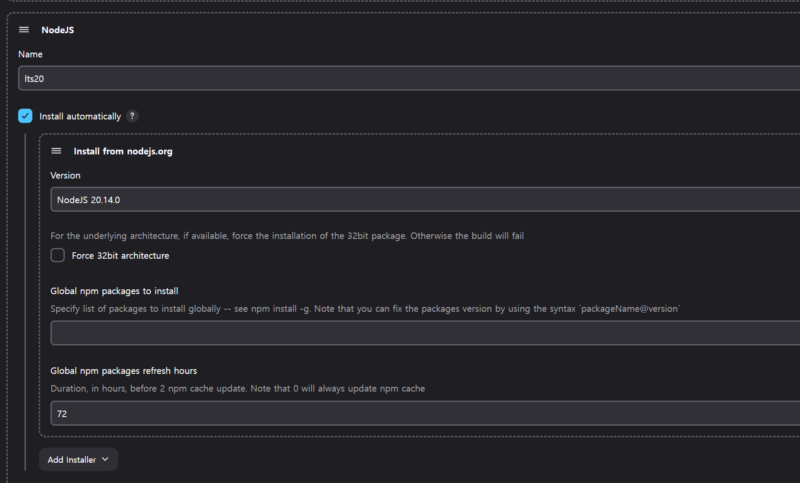
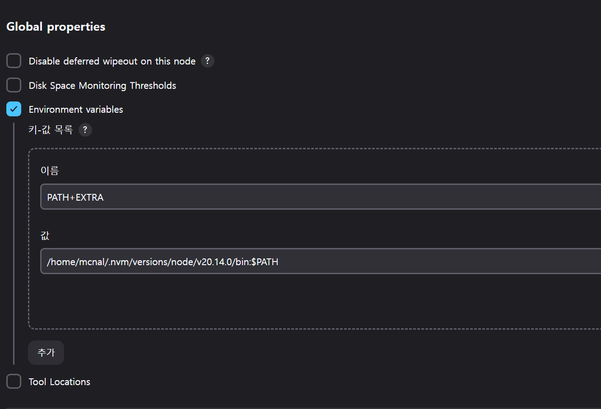
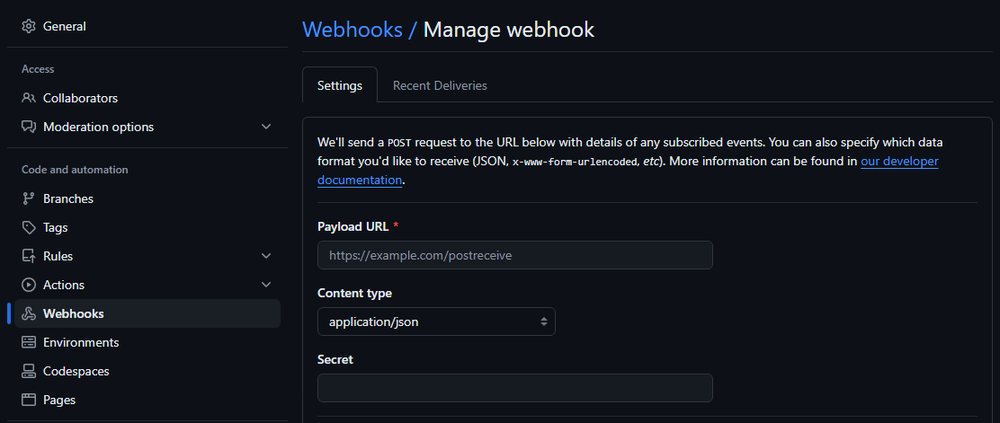
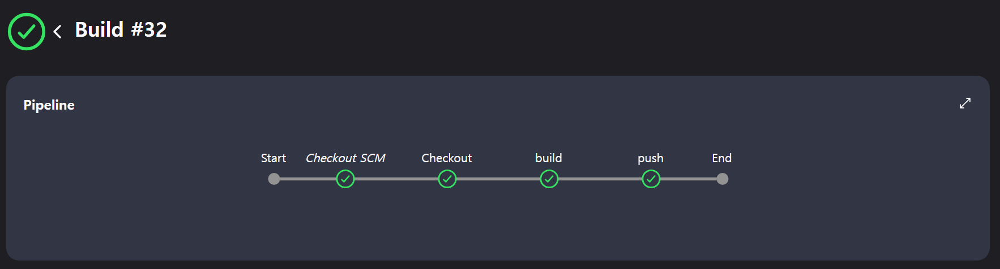
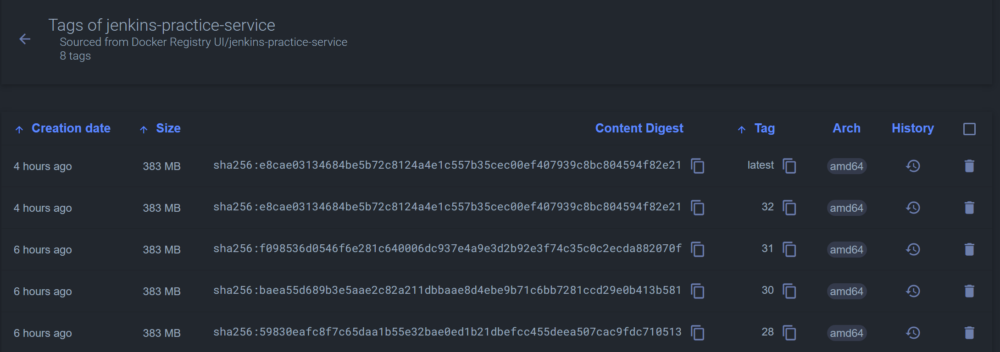

# Jenkins 구성

## pipeline 구성

Jenkins에서 pipeline을 구성한다.

- github의 repository를 사용하기 위해 `GitHub project`체크
- `Pipeline` > `Pipeline script from SCM` 선택
  - Repository : 서비스 URL 입력
  - Credetials : 사전설치 때 등록하였던 ssh-key 선택
  - Branches to build : Master branch가 아닌 다른 Branch를 원하면 변경
  - Script Path : pipeline에서 사용할 Jekinsfile의 경로를 지정
    - git의 최상위 폴더에 있을 경우 `Jenkinsfile`
    - 하위 폴더에 있을 경우 `path/to/Jenkinsfile`

> `Pipeline script from SCM`을 선택할 경우 `Jenkinsfile`을 가져오기 위해서 git clone이 한번 이루어지기 때문에 후술하는 `Jenkinsfile`에서 `Checkout` stage 없이도 정상동작한다.

> Pipeline script를 선택하여 스크립트를 직접 작성할 수 있다.
> 하지만 버전관리 등의 관점에서 생각해 보았을 때 repository에 포함되 있는 것이 유리하다고 생각된다.

## tool 구성

nodejs와 docker를 사용하기 위해서 plugin에서 `NodeJS Plugin`과 `Docker Pipeline`를 설치한다.

`whoami`커맨드 등의 방식으로 로그를 출력하면 pipeline실행은 기본 유저가 아닌 `jenkins`라는 유저로 실행됨을 알 수 있다.

이 경우 `nvm`등을 통해서 `nodejs`를 설치 할 경우 기존의 PATH(/usr/bin)에 설치되지 않기 때문에 `not found`에러가 발생할 수 있다.

> `sudo -u jenkins -i` 를 사용하여 `jenkins` 유저로 `echo $PATH`를 실행해본다.
> 혹은 `Jenkins 관리` > `System Information` 에서 환경변수를 확인할 수 있다.

스크립트에서 PATH를 지정하거나 혹은 스크립트에서 node를 설치하는 등 방법은 다양하다.

다양한 방법들 중 `Tools`에서 `install automatically`옵션을 사용하여 구성하는 것이 추가적인 설치 없이 가장 간편하게 구성가능하여 사용하였다.



> Jenkins관리 > System > Global properties에서 PATH를 지정할 수 있다.
> 이경우 호스트에 설치된 node를 사용하므로 plugin 비활성화, tool지정 없이 사용 가능하다.
> 

> PATH 변경은 `/var/lib/jenkins/config.xml` 설정파일을 직접 수정하는 것도 가능하다.

## Jenkinsfile

```Groovy
pipeline{
    agent any
    tools { nodejs 'lts20'}
    environment {
        DOCKER_IMAGE = "jenkins-practice-service"
        DOCKER_REGISTRY_URL = "https://private.registry"
    }
    stages{
        stage('Checkout'){
            steps{
                checkout scm
            }
        }
        stage('build'){
            steps{
                script{
                    sh 'npm install'
                    appImage = docker.build("${DOCKER_IMAGE}")
                }
            }
        }
        stage('push'){
            steps{
                script{
                    docker.withRegistry("${DOCKER_REGISTRY_URL}"){
                        appImage.push("${env.BUILD_ID}")
                        appImage.push("latest")
                    }
                }
            }
        }
    }
    post{
        failure{
            echo 'clean up'
            deleteDir()
        }
    }
}
```

- agent : 단일노드의 Jenkins에서 동작하기에 별다른 설정을 하지는 않는다.
- tools : `npm install`등의 커맨드를 사용하기 위한 `nodejs tool`을 명명한다.
- environment
  - env.BUILD_ID : 내제되어있는 기본 변수를 사용하여 build한 이미지에 tag를 지정한다.
- stages
  - checkout : `checkout scm`을 사용하여 소스코드를 가져올 수 있다.
  - build : 의존성 설치하고 docker를 사용하여 build한다.
  - push : 지정한 repository에 `latest` 태그와 `BUILD_ID`를 태그로 하여 push한다.

> `checkout scm`의 경우 `Pipeline script from SCM` 을 선택하였기에 사용가능하다. 이외의 경우에는 `git 'https://repositoryURL.git'` 을 사용하여 소스코드를 Git 리포지토리에서 체크아웃할 수 있다.

## Automation

모든 설정이 완료될 경우 수동으로 pipeline을 동작시킬 수 있다.

자동으로 CI를 수행하는 방법은 크게 두가지 있다.

1. Github Webhook을 이용해 push가 일어나면 Jenkins가 trigger
2. 주기적으로 pipeline을 동작
   - 변화가 없어도 수행
   - 변화가 있을 경우 수행

### Github Webhook

Webhook을 사용할 때 Jenkins의 URL은 IP형식의 주소는 사용할 수 없고 도메인형식으로만 사용가능

Public repository 일 경우 별도의 인증없이 URL만 입력하여 webhook이 가능하다.



- URL : `https://domain.com/github-webhook/`
- Content type : `application/json`

private repository 일 경우 `Personal access token(classic)`이 필요하다. `repo`와 `admin:repo_hook` 권한을 지정하여 token을 생성한다.

이후 Jenkins에서 credential을 등록한다.
- type : `Username with password`
- Username : github 사용자이름
- Password : `access token`
- ID : credential 이름

생성한 `credential`은 pipeline에서 사용한다.

```groovy
pipeline {
    agent any
    stages {
        stage('Checkout') {
            steps {
                git branch: 'master',
                    credentialsId: 'credential_ID',
                    url: 'https://github.com/user/repository.git'
            }
        }
    }
}
```

> Pipeline을 `Pipeline script from SCM`으로 설정하였을 경우 `checkout stage`의 `credentialsID`뿐만 아니라 Pipeline의 `credential`도 해당 token으로 변경해주어야 한다.

### Cron

schedule을 설정하여 특정 주기마다 실행되도록 설정할 수 있다.

- Build periodically : 주기마다 실행
- Poll SCM : 주기마다 Git에서 pull하고 기존과 다를경우에 실행

# 실행결과

github에 push가 일어나면 자동으로 pipeline이 실행되어 private registry로 build된 docker image가 push되는 것을 확인할 수 있다.



